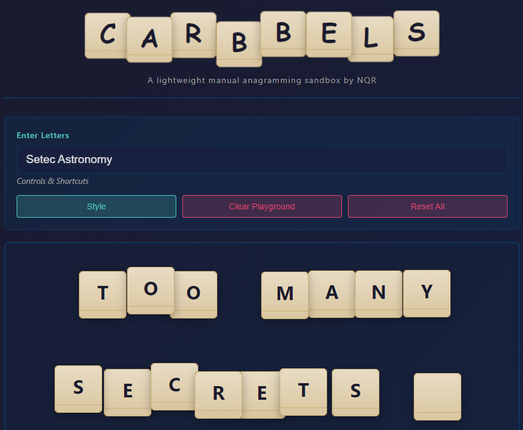

# Carbbels

Carbbels is a manual anagram sandbox designed for puzzle-solving and exploratory wordplay. It is intentionally **not a game**. Instead, it is a flexible workspace where letters can be typed, dragged, grouped, reordered visually, copied into different sequences, and used for puzzle deduction. Originally built to support an Alternate Reality Game (ARG).

---

## ? Features

### ?? Text ? Tile Sync
- Typing automatically creates draggable letter tiles
- Deleting in the textbox removes the corresponding tiles
- Dragging or deleting tiles updates the textbox
- Pasting multiple characters spreads tiles into free positions

### ?? Sandbox Interaction
- Drag single or multiple tiles freely across the grid
- Box-selection to select groups quickly
- Click + Ctrl to toggle tile in/out of the selection group
- Selection persists across group movements
- Snap-free movement encourages creative layouts

### ?? Puzzle Tools
- Layout shortcuts for rapid rearrangement:
  - `G`: Group horizontally
  - `H`: Evenly distribute horizontally
  - `V`: Evenly distribute vertically
  - Arrow keys: Align tiles to shared axis

### ? Copy Visual Order
- **Ctrl + Shift + C**  
  Copy letters in **left-to-right, top-to-bottom** order  
  Useful when the playable layout spells something the typed word doesn't

### ? Undo / Redo
- **Ctrl + Z** undo (multi-step)
- **Ctrl + Y** redo (multi-step)
- Every meaningful action is reversible

---

## ?? Why Carbbels Exists

Unlike typical unscramble-the-word UIs, Carbbels is about:
- Experimentation
- Interpretation of letter **arrangement**
- Insight through spatial reasoning

Tiles are objects you manipulate, not fixed positions.

Carbbels supports puzzle designers and players who think:
> “Maybe the pattern matters as much as the word.”

---

## ?? Keyboard + Mouse Reference

| Action | Shortcut / Gesture |
|--------|------------------|
| Add tiles | Type letters |
| Delete selection | Delete / Backspace |
| Copy sandbox word (visual order) | Ctrl + Shift + C |
| Undo | Ctrl + Z |
| Redo | Ctrl + Y |
| Select all tiles | Ctrl + A |
| Toggle selection | Ctrl + Click |
| Box-select group | Click + Drag background |
| Move selection | Drag on tile |
| Align vertically | ? / ? |
| Align horizontally | ? / ? |
| Group row | G |
| Evenly distribute horizontally | H |
| Evenly distribute vertically | V |

---

## ?? Tech Overview

- HTML / CSS UI
- Vanilla JavaScript state engine
- No framework dependencies
- Local-only — no server or tracking
- Designed to embed easily in a webflow / CMS / puzzle site

---

## ?? Future Ideas

- Save / Load layouts
- Custom puzzle exports (sequence metadata)
- Mobile touch enhancements
- Tile rotation for even deeper wordplay
- Grid “snap-to” mode toggle

---

## ?? License

MIT License — free to modify and use anywhere.  
Attribution appreciated if used in public puzzles. ??

---

## ?? Credit

Designed for creative thinkers and ARG explorers who know that sometimes the answer is found by *moving the letters around*.

If you use Carbbels in a puzzle, I’d love to hear about it!

