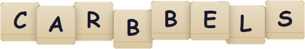

# Carbbels

Carbbels is a manual anagram sandbox designed for puzzle-solving and exploratory wordplay. It is intentionally not a game. Instead, it is a flexible workspace where letters can be typed, dragged, grouped, visually reordered, copied into different sequences, and used for puzzle deduction. 

[**View Live Demo**](nqrlabs.com/Carbbels/)

## Features

### Text and Tile Sync
- Typing automatically creates draggable letter tiles
- Deleting in the textbox removes the corresponding tiles
- Dragging or deleting tiles updates the textbox
- Pasting multiple characters spreads tiles into free positions

### Sandbox Interaction
- Drag single or multiple tiles freely across the grid
- Box-select to select groups quickly
- Ctrl + Click to toggle individual tiles in the selection
- Selection persists across movement
- Snap-free movement helps experimental layouts

### Puzzle Tools
- `G`: Group selected tiles horizontally
- `H`: Evenly distribute selected tiles horizontally
- `V`: Evenly distribute selected tiles vertically
- Arrow keys: Align tiles to a shared axis

### Copy Visual Order
- **Ctrl + Shift + C**: Copy tile letters in visual left-to-right, top-to-bottom order

### Undo / Redo
- **Ctrl + Z**: Undo last action
- **Ctrl + Y**: Redo undone action

## Why Carbbels Exists

Carbbels was created for situations where:
- Layout conveys meaning
- Words may need physical reordering
- Discovery happens through experimentation

Tiles remain movable objects rather than fixed positions.

> Some puzzles reveal their answers only when you move the letters around.

## Keyboard and Mouse Reference

| Action | Shortcut / Gesture |
|--------|------------------|
| Add tiles from text | Type letters |
| Delete selection | Delete / Backspace |
| Copy visual order | Ctrl + Shift + C |
| Undo | Ctrl + Z |
| Redo | Ctrl + Y |
| Select all tiles | Ctrl + A |
| Toggle selected tile | Ctrl + Click |
| Box-select group | Click + Drag background |
| Move selection | Drag a tile |
| Align vertically | Left / Right Arrow |
| Align horizontally | Up / Down Arrow |
| Group row | G |
| Evenly distribute horizontally | H |
| Evenly distribute vertically | V |

## Tech Overview

- HTML / CSS interface
- Vanilla JavaScript state engine
- No framework dependencies
- Local-only (no server required)
- Easy to embed in ARGs, puzzle hunts, and escape-room-style web pages

## License

MIT License - free for modification and use. Attribution appreciated if used publicly.

## Credit

Created by **NQR** for puzzle solvers, game designers, and curious thinkers. If you use Carbbels in a puzzle or ARG, I'd love to hear about it.
